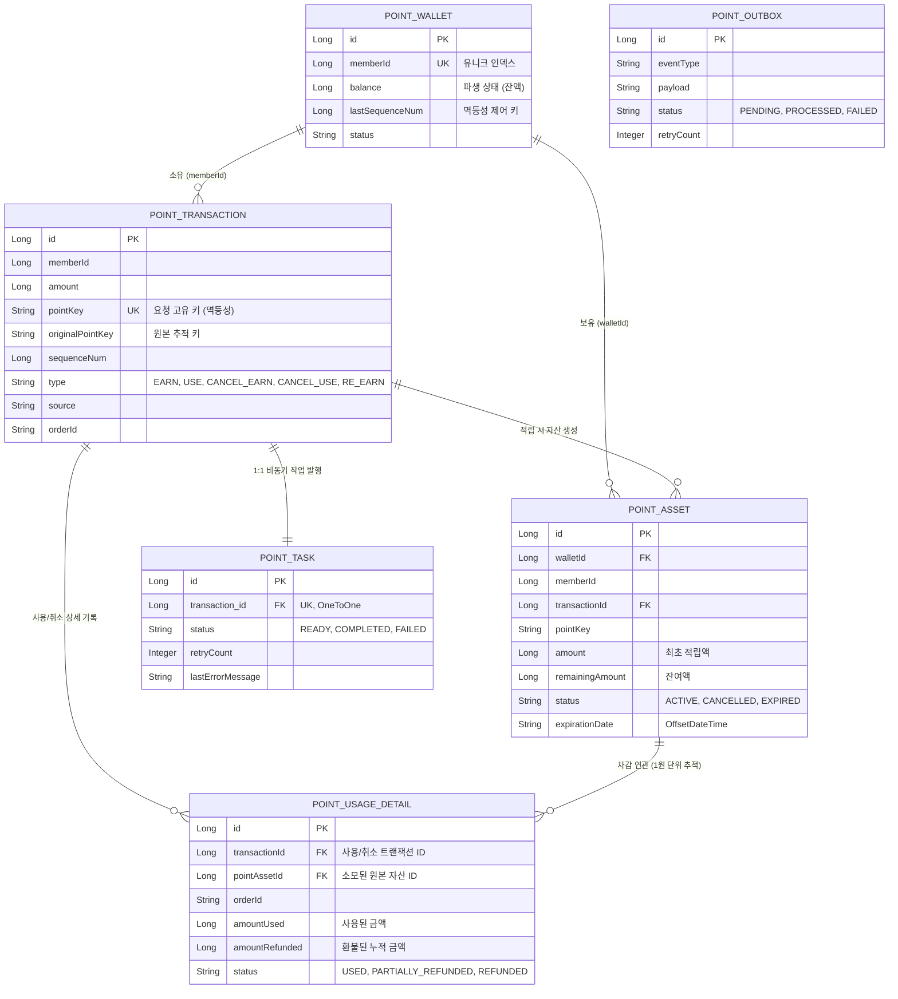

```mermaid
erDiagram
    POINT_WALLET ||--o{ POINT_TRANSACTION : "소유 (memberId)"
    POINT_WALLET ||--o{ POINT_ASSET : "보유 (walletId)"

    POINT_TRANSACTION ||--|| POINT_TASK : "1:1 비동기 작업 발행"
    POINT_TRANSACTION ||--o{ POINT_ASSET : "적립 시 자산 생성"
    POINT_TRANSACTION ||--o{ POINT_USAGE_DETAIL : "사용/취소 상세 기록"

    POINT_ASSET ||--o{ POINT_USAGE_DETAIL : "차감 연관 (1원 단위 추적)"

    POINT_WALLET {
        Long id PK
        Long memberId UK "유니크 인덱스"
        Long balance "파생 상태 (잔액)"
        Long lastSequenceNum "멱등성 제어 키"
        String status
    }

    POINT_TRANSACTION {
        Long id PK
        Long memberId
        Long amount
        String pointKey UK "요청 고유 키 (멱등성)"
        String originalPointKey "원본 추적 키"
        Long sequenceNum
        String type "EARN, USE, CANCEL_EARN, CANCEL_USE, RE_EARN"
        String source
        String orderId
    }

    POINT_ASSET {
        Long id PK
        Long walletId FK
        Long memberId
        Long transactionId FK
        String pointKey
        Long amount "최초 적립액"
        Long remainingAmount "잔여액"
        String status "ACTIVE, CANCELLED, EXPIRED"
        String expirationDate "OffsetDateTime"
    }

    POINT_USAGE_DETAIL {
        Long id PK
        Long transactionId FK "사용/취소 트랜잭션 ID"
        Long pointAssetId FK "소모된 원본 자산 ID"
        String orderId
        Long amountUsed "사용된 금액"
        Long amountRefunded "환불된 누적 금액"
        String status "USED, PARTIALLY_REFUNDED, REFUNDED"
    }

    POINT_TASK {
        Long id PK
        Long transaction_id FK "UK, OneToOne"
        String status "READY, COMPLETED, FAILED"
        Integer retryCount
        String lastErrorMessage
    }

    POINT_OUTBOX {
        Long id PK
        String eventType
        String payload
        String status "PENDING, PROCESSED, FAILED"
        Integer retryCount
    }
```
